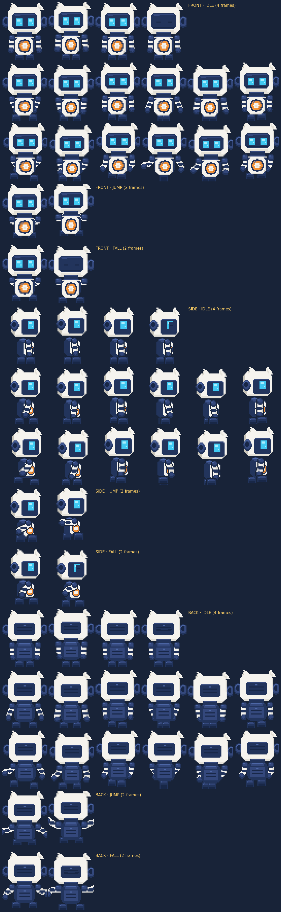

# Robot-gato · Aventura lateral (side-scroller)

Juego **side-scroller** jugable cuyo único personaje es el **robot-gato** que
dibujaste: se le han diseñado todos los frames que faltaban, a partir de tu
imagen y manteniendo su diseño, colores y proporciones exactos.

Incluye las vistas **de frente**, **de perfil** y **de espaldas**, y el
movimiento **a la izquierda y a la derecha** en las dos vistas laterales
(la vista izquierda es el espejo exacto de la derecha). El personaje cambia de
vista solo: de perfil cuando se mueve (hacia el lado al que va), de frente al
quedarse quieto y de espaldas si te quedas mucho rato parado.

Abre **`index.html`** en el navegador y juega.



---

## Controles

| Acción | Teclas |
| --- | --- |
| Moverse | `←` `→` o `A` `D` |
| Saltar | `Espacio`, `↑` o `W` (altura variable: suelta para saltar menos) |
| Correr | `Shift` (o `X`) |
| Reiniciar nivel | `R` · Pausa `P` · Silenciar `M` |
| Panel de personaje | `S` · Frames: `H` · Opciones: `O` |
| Avanzar 1 frame (en pausa) | `F` · Modo invulnerable `G` |

En móvil aparecen controles táctiles.

---

## El personaje y sus frames

El robot se dibuja por **piezas** (cabeza, torso, brazos, pies) en
`tools/robot.mjs`, con la misma paleta y la misma construcción que tu imagen:
cabeza grande con orejas de gato, visor azul marino con ojos cian, aros
laterales, casco azul con placa blanca en la barriga y emblema de anillo
naranja, brazos segmentados con puños y pies pequeños. Al salir todos los
frames del mismo modelo, las animaciones son coherentes entre sí.

| Animación | Frames | Qué hace |
| --- | --- | --- |
| `idle` | 4 | respira, parpadea y las orejas se mueven |
| `walk` | 6 | ciclo de caminar (contacto, apoyo, paso × 2) |
| `run` | 6 | zancada inclinada con fase de vuelo |
| `jump` | 2 | impulso con las piernas recogidas |
| `fall` | 2 | caída con los brazos abiertos |

Cada animación existe en **las tres vistas y en los dos sentidos**:

| Hoja | Qué contiene |
| --- | --- |
| `assets/robot-front-sheet.png` | de frente (20 frames) |
| `assets/robot-side-sheet.png` | perfil mirando a la derecha |
| `assets/robot-left-sheet.png` | perfil mirando a la **izquierda** (espejo exacto) |
| `assets/robot-right-sheet.png` | igual que el perfil (movimiento a la derecha) |
| `assets/robot-back-sheet.png` | de espaldas |
| `assets/robot-front-left-sheet.png` / `-right-sheet.png` | de frente mirando a cada lado |
| `assets/robot-referencia.png` | todas las vistas y animaciones, ampliadas y etiquetadas |
| `assets/plantilla-hoja-sprites.png` | plantilla vacía para dibujar tus propias hojas |

Layout de cada hoja: **una fila por animación** (idle, walk, run, jump, fall),
**una columna por frame**, celdas de 44×56 px, fondo transparente y el
personaje apoyado abajo (ancla centro-abajo). El juego escala la altura del
personaje a ~30 px en pantalla.

### Regenerar el arte

```bash
node tools/build-robot.mjs
```

Genera todas las hojas PNG, la referencia etiquetada, la plantilla y
`js/robot-sheet.js` (las tres hojas embebidas en base64, para que `index.html`
funcione incluso abriéndolo con `file://`).

---

## El juego

- Nivel de 2.760 px con plataformas, monedas, enemigos que patrullan y meta.
- Física de plataformas: aceleración, fricción, gravedad, salto de altura
  variable (2 alturas del personaje), *coyote time* y buffer de salto.
- 3 corazones, invulnerabilidad tras un golpe, reaparición en el último punto
  seguro, tiempo, monedas y puntos.
- Aplasta enemigos cayendo encima; de lado, te hacen daño.
- Fondo con parallax en 3 capas, partículas, sacudida de cámara y sonidos
  sintetizados con WebAudio (sin archivos de audio).
- Panel **Frames**: todos los frames de la vista activa, con zoom y animación.
- Panel **Opciones**: piloto automático (el robot se juega el nivel solo, útil
  para ver todas las animaciones), andar de frente, puntos de colisión,
  sombras, parallax, velocidad y FPS.

### Cambiar de vista

- **Auto** (por defecto): perfil al moverse —izquierda o derecha según hacia
  dónde vaya—, frente al pararse y espaldas tras unos segundos quieto.
- **Frente / Perfil / Espaldas**: fija la vista a mano.
- En Opciones, *«andar de frente»* deja el robot mirando al frente mientras
  camina o corre (el sprite se espeja hacia el lado de la marcha).

---

## Usar otro sprite

En el panel **Sprite → Cargar otro sprite** puedes subir tu propio PNG: el
juego intenta **detectar la rejilla** automáticamente por las zonas
transparentes y, si no, ajustas ancho/alto de frame y frames por fila a mano.
Requisitos: fondo transparente, una fila por animación en el orden
`idle, walk, run, jump, fall` y el personaje apoyado abajo de cada celda.
Puedes empezar por `assets/plantilla-hoja-sprites.png`.

---

## Estructura

```
index.html                 interfaz: lienzo, HUD, paneles, overlays
css/style.css              estilos (tema oscuro arcade, responsive)
js/robot-sheet.js          las hojas del robot en base64 (generado)
js/sprites.js              hojas de sprites: recortar, detectar rejilla, espejar
js/input.js                teclado + táctil, buffer de salto
js/audio.js                efectos WebAudio
js/game.js                 motor: física, animaciones, vistas, entidades, render
js/ui.js                   HUD, overlays, panel de personaje e inspector
assets/                    hojas del robot, referencia y plantilla
tools/robot.mjs            el robot por piezas y todas las poses
tools/pixel.mjs            lienzo de pixel art (formas, contorno, composición)
tools/png.mjs              codificar/decodificar PNG sin dependencias
tools/build-robot.mjs      genera hojas, plantilla y datos
tools/smoke-test.mjs       21 comprobaciones automáticas (jsdom)
tools/render-shot.mjs      "capturas" del juego sin navegador
```

## Pruebas

```bash
npm install jsdom          # única dependencia, solo para las pruebas
node tools/smoke-test.mjs
```

Comprueba el arranque, las cuatro animaciones de movimiento, el salto de dos
alturas, el render, monedas y enemigos, que el piloto automático completa el
nivel, que las cinco hojas del robot están disponibles y **que la vista cambia
al caminar a la derecha, a la izquierda y al pararse**.
`node tools/render-shot.mjs` dibuja escenas reales del juego a PNG usando un
canvas simulado (incluidos primeros planos del personaje en cada vista).

## Créditos

Personaje original (robot-gato) y diseño de referencia: el usuario.
Frames, motor, arte del escenario y sonido generados para este repositorio;
sin dependencias en tiempo de ejecución.
