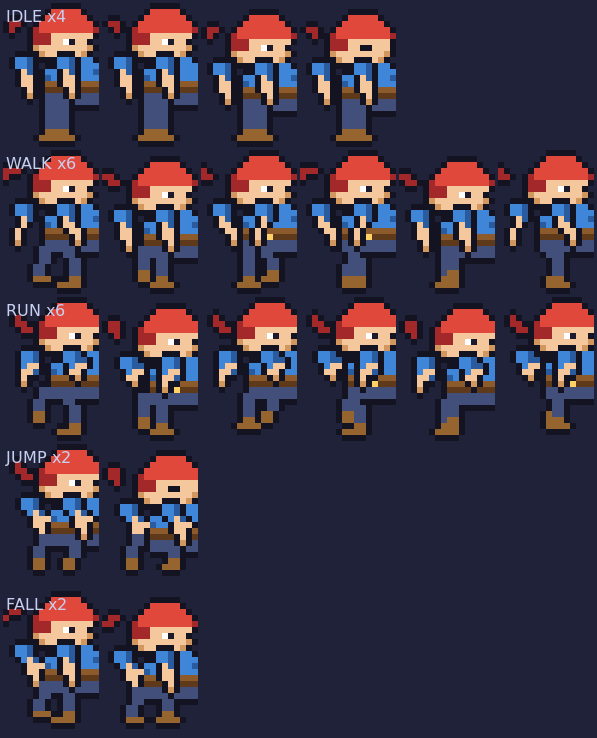

# Sprites · Aventura lateral (side-scroller)

Demo jugable de **side-scroller** con un héroe pixel art al que se le han diseñado
**todos los frames de animación**: reposo, caminar, correr, salto y caída.
Incluye además un **cargador de hojas de sprites** para usar tus propios dibujos
en el juego sin tocar código.

Abre **`index.html`** en el navegador y juega.



---

## Controles

| Acción | Teclas |
| --- | --- |
| Moverse | `←` `→` o `A` `D` |
| Saltar | `Espacio`, `↑` o `W` (altura variable: suelta para saltar menos) |
| Correr | `Shift` (o `X`) |
| Reiniciar nivel | `R` |
| Pausa | `P` |
| Silenciar | `M` |
| Panel de sprite | `S` · Frames: `H` · Opciones: `O` |
| Avanzar 1 frame (en pausa) | `F` |
| Modo invulnerable | `G` |

En móvil aparecen controles táctiles (joystick de dirección + salto).

---

## Los frames del héroe

El personaje está dibujado a mano como arte ASCII en `tools/hero-parts.mjs`
(16×24 px) y se compone por capas —cabeza, torso, brazos, piernas, cola de la
bandana— así que se pueden variar poses sin redibujar el resto. El contorno
oscuro se genera automáticamente alrededor de la silueta y entre los brazos y
el cuerpo.

| Animación | Frames | Uso en el juego |
| --- | --- | --- |
| `idle` | 4 | quieto: respira, parpadea y la bandana se mueve |
| `walk` | 6 | ciclo de caminar (contacto, apoyo, paso × 2) |
| `run` | 6 | zancada inclinada con fase de vuelo |
| `jump` | 2 | impulso con las piernas recogidas |
| `fall` | 2 | caída con los brazos abiertos |

La máquina de estados del juego elige la animación por velocidad y estado de
suelo, y ajusta los FPS a la velocidad real, con *coyote time* (0,09 s) y
buffer de salto (0,12 s) para que controlar al personaje sea agradable.

### Regenerar el arte

```bash
node tools/build.mjs
```

Genera:

- `assets/hero-sheet.png` — hoja de sprites (filas = animaciones, columnas = frames)
- `assets/hoja-heroe-etiquetada.png` — la misma hoja ampliada ×6 y con etiquetas
- `assets/plantilla-hoja-sprites.png` — plantilla vacía para dibujar tu propia hoja
- `js/hero-frames.js` — los frames como datos que consume el juego
- `js/hero-png.js` — la hoja embebida en base64 (permite abrir el HTML con `file://`)

---

## Usar tu propio sprite

1. Pulsa **Sprite** en el juego (o `S`).
2. **Elegir PNG…** o arrastra la imagen sobre el recuadro del juego.
3. El juego intenta **detectar la rejilla** automáticamente separando los frames
   por las zonas transparentes; si tu hoja no tiene separación, ajusta
   *Ancho de frame*, *Alto de frame*, *Separación* y el número de frames por
   animación, y pulsa **Aplicar**.

Requisitos de la hoja:

- fondo **transparente** (PNG);
- **una fila por animación**, en el orden que elijas en el desplegable
  (por defecto `idle → walk → run → jump → fall`);
- el personaje **apoyado abajo** dentro de cada celda: el juego ancla cada frame
  por el centro-abajo (los pies) y escala la altura del sprite a ~30 px, así que
  el tamaño en píxeles de la hoja es libre;
- la caja de colisión se calcula del tamaño del frame, y el salto del personaje
  mide siempre 2 alturas de su propio cuerpo, por lo que cualquier sprite
  mantiene el nivel jugable.

Si una fila falta, se reutiliza la animación disponible más parecida
(si no hay `run` se usa `walk`, si no hay `jump`/`fall` se usa `idle`).

Puedes empezar por `assets/plantilla-hoja-sprites.png`.

---

## El juego

- Nivel de 2.760 px con plataformas, monedas, enemigos que patrullan y meta.
- Física de plataformas: aceleración, fricción, gravedad, salto de altura
  variable y huecos de 44 px medidos para cruzarse justo andando.
- 3 corazones, invulnerabilidad tras un golpe, reaparición en el último punto
  seguro, contador de tiempo, monedas y puntos.
- Aplasta enemigos cayendo encima (rebote de ~40 px); si te tocan de lado, daño.
- Fondo con parallax en 3 capas, partículas, sacudida de cámara y efectos de
  sonido sintetizados con WebAudio (sin archivos de audio).
- `Opciones`: piloto automático (el héroe se juega el nivel solo, útil para ver
  todas las animaciones seguidas), puntos de colisión, sombras, parallax,
  velocidad del juego y contador de FPS.
- El panel **Frames** muestra todos los frames del sprite activo con zoom y
  animación en vivo, resaltando el frame que el motor está usando.

---

## Estructura

```
index.html                  interfaz: lienzo, HUD, paneles, overlays
css/style.css               estilos (tema oscuro arcade, responsive)
js/sprites.js               hojas de sprites: generar, recortar, detectar rejilla
js/input.js                 teclado + táctil, buffer de salto
js/audio.js                 efectos WebAudio
js/game.js                  motor: física, animaciones, entidades, render
js/ui.js                    HUD, overlays, panel de sprite e inspector
js/hero-frames.js           frames del héroe (generado)
js/hero-png.js              hoja embebida en base64 (generado)
assets/                     hojas y previsualizaciones del arte
tools/hero-parts.mjs        taller de pixel art por capas
tools/build.mjs             genera hojas, datos y previsualizaciones
tools/smoke-test.mjs        18 comprobaciones automáticas (jsdom)
tools/render-shot.mjs       "capturas" del juego sin navegador
```

## Pruebas

```bash
npm install jsdom          # única dependencia, solo para las pruebas
node tools/smoke-test.mjs
```

Comprueba el arranque, las cuatro animaciones de movimiento, el salto de dos
alturas, el render, la recogida de monedas, el aplastado de enemigos, que el
piloto automático completa el nivel, la carga de un sprite propio y que el panel
de interfaz funciona. `node tools/render-shot.mjs` dibuja escenas reales del
juego a PNG usando un canvas simulado.

## Créditos

Arte, código y sonido generados para este repositorio; sin dependencias en
tiempo de ejecución.
